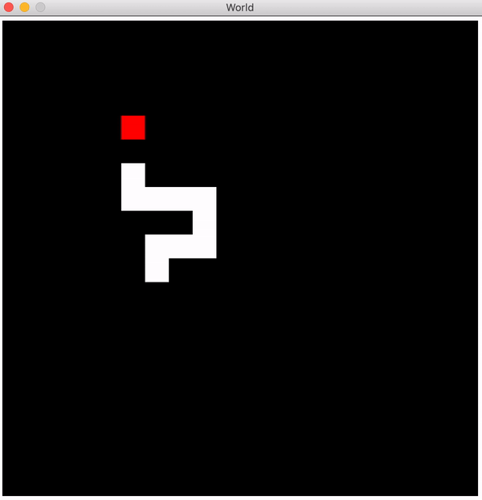

# Snake
An implementation of the classic snake game with racket. Control the snake around a 20x20 grid with arrow keys. Ticks 4 times a second.

 "Snake Game")

### Installation/Usage
```sh
$ git clone github.com/jhsul/snake && cd snake/
$ racket snake.rkt
```
